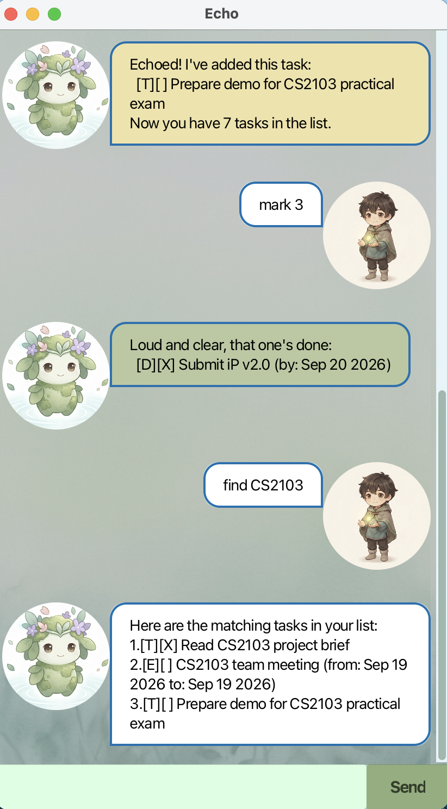

# Echo User Guide

Echo is a desktop chatbot for keeping track of your tasks — todos, deadlines,
and events — through a simple chat-style GUI. Type a command, hit Enter (or
click Send), and Echo tosses your task list right back at you.



## Quick start

1. Ensure you have Java 25 installed on your computer.
2. Download the latest `echo.jar` from the [releases page](https://github.com/jingyucodes/ip/releases).
3. Double-click the file to start the app, or run it from a terminal:
   ```
   java -jar echo.jar
   ```
4. Type a command into the box at the bottom and press Enter to see Echo respond.
   Try `todo read book` to get started, then `list` to see it in your list.

## Features

> **Notes on the command format**
> * Words in `UPPER_CASE` are parameters you supply, e.g. in `todo DESCRIPTION`,
>   `DESCRIPTION` could be `todo return book`.
> * Dates are given as `yyyy-mm-dd`, e.g. `2019-10-15`.
> * Task numbers refer to the position shown the last time you ran `list`
>   (or `find`/`on`), counting from 1.

### Adding a todo: `todo`

Adds a task with no date attached.

Format: `todo DESCRIPTION`

Example: `todo read book`
```
Echoed! I've added this task:
  [T][ ] read book
Now you have 1 task in the list.
```

### Adding a deadline: `deadline`

Adds a task that needs to be done by a specific date.

Format: `deadline DESCRIPTION /by DATE`

Example: `deadline return book /by 2019-10-15`
```
Echoed! I've added this task:
  [D][ ] return book (by: Oct 15 2019)
Now you have 2 tasks in the list.
```

### Adding an event: `event`

Adds a task that spans a period of time.

Format: `event DESCRIPTION /from DATE /to DATE`

* The `/to` date cannot be earlier than the `/from` date.

Example: `event project meeting /from 2019-10-15 /to 2019-10-16`

### Listing all tasks: `list`

Shows every task currently in your list, numbered from 1.

Format: `list`

### Marking a task as done: `mark`

Marks the given task as done.

Format: `mark INDEX`

Example: `mark 2` marks the 2nd task in the list as done.

### Marking a task as not done: `unmark`

Marks the given task as not done.

Format: `unmark INDEX`

### Deleting a task: `delete`

Removes the given task from your list for good.

Format: `delete INDEX`

Example: `delete 3` removes the 3rd task in the list.

### Finding tasks: `find`

Shows tasks whose description contains the given keyword. The search
ignores capitalization.

Format: `find KEYWORD`

Example: `find book` matches both "read book" and "Book club".

### Viewing tasks on a date: `on`

Shows deadlines and events that fall on the given date.

Format: `on DATE`

Example: `on 2019-10-15`

### Archiving tasks: `archive`

Moves every task out of your active list into a separate archive file,
keeping a record of them without cluttering your day-to-day list.
Archiving is cumulative: doing it again later adds to the same archive
file instead of overwriting it.

Format: `archive`

Example:
```
Archived 2 task(s). All clear for now.
```

If your list is already empty, Echo tells you there's nothing to
archive instead:
```
There's nothing to archive. Your list is already empty.
```

### Exiting the program: `bye`

Format: `bye`

## Saving your data

Echo automatically saves your task list to disk after every change, and
reloads it the next time you open the app. There's no need to save
manually.

## Duplicate tasks

Echo won't let you add the same task twice — a todo/deadline/event with
a matching description (and matching dates, for deadlines and events)
is treated as a duplicate and rejected with an error, rather than being
added a second time.

## Command summary

| Action | Format | Example |
|---|---|---|
| Todo | `todo DESCRIPTION` | `todo read book` |
| Deadline | `deadline DESCRIPTION /by DATE` | `deadline return book /by 2019-10-15` |
| Event | `event DESCRIPTION /from DATE /to DATE` | `event meeting /from 2019-10-15 /to 2019-10-16` |
| List | `list` | `list` |
| Mark | `mark INDEX` | `mark 2` |
| Unmark | `unmark INDEX` | `unmark 2` |
| Delete | `delete INDEX` | `delete 3` |
| Find | `find KEYWORD` | `find book` |
| On | `on DATE` | `on 2019-10-15` |
| Archive | `archive` | `archive` |
| Exit | `bye` | `bye` |
